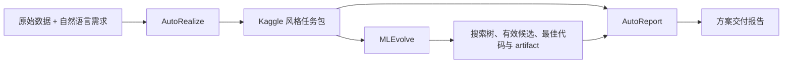

# AutoReport

[](LICENSE)
[](https://www.python.org/)

AutoReport 是 AutoDecision 的**最终方案研究与交付报告生成器**。它读取 AutoRealize 生成的 Kaggle 风格任务包，以及 MLEvolve 搜索过程中已经通过 Result Review 的候选方案、代码、指标和模型/求解器产物，生成一份可供使用者审阅和复用的 Markdown 报告。



## 报告结构

默认报告要求包含以下章节：

1. 摘要与最终方案；
2. 问题解析与重要约束；
3. 问题建模；
4. 最佳方法详解；
5. 候选方法与效果对比；
6. 最佳方法的提升来源；
7. 直接使用已训练模型、策略或求解器；
8. 重新训练或重新求解；
9. 接入其他系统；
10. 限制与注意事项。

预测和强化学习任务优先说明怎样加载已有模型或策略；静态优化/决策任务如果没有训练 artifact，则优先说明怎样直接调用求解器。代码中不存在的 `predict()`、模型文件或命令不能由报告补造。

## 环境要求

- Conda、Miniconda 或 Miniforge；
- **Python 3.12**；
- 可访问的 OpenAI-compatible Chat Completions API；
- 已完成或部分完成的 AutoRealize / MLEvolve 输出目录；
- 对证据目录的读取权限和报告目录的写入权限。

## 使用 Conda 安装

### 1. 克隆仓库

```bash
git clone https://github.com/DonaLdZY/AutoReport.git
cd AutoReport
```

### 2. 创建 Python 3.12 环境

```bash
conda create -n autoreport python=3.12 pip -y
conda activate autoreport
python -m pip install --upgrade pip
python -m pip install -r requirements.txt
```

验证解释器和模块位置：

```bash
python --version
python -c "import autoreport; print(autoreport.__version__); print(autoreport.__file__)"
```

第一条命令应输出 `Python 3.12.x`，模块路径应指向当前仓库中的 `autoreport/__init__.py`。

开发和测试依赖：

```bash
python -m pip install -r requirements-dev.txt
```

## 配置

默认配置是 [`config/config.yaml`](config/config.yaml)。建议复制到仓库外作为私有运行配置，避免误提交 Key、用户名或本地绝对路径。

Linux / macOS：

```bash
mkdir -p "$HOME/.config/autoreport"
cp config/config.yaml "$HOME/.config/autoreport/config.yaml"
export DEEPSEEK_API_KEY="your_api_key"
```

Windows PowerShell：

```powershell
New-Item -ItemType Directory -Force "$HOME\.autoreport" | Out-Null
Copy-Item ".\config\config.yaml" "$HOME\.autoreport\config.yaml"
$env:DEEPSEEK_API_KEY = "your_api_key"
```

`llm.api_key` 非空时配置文件优先；为 `null` 时读取 `DEEPSEEK_API_KEY`。即使使用其他 OpenAI-compatible provider，当前版本读取的文本模型环境变量名仍是 `DEEPSEEK_API_KEY`。

### 最小配置

```yaml
task_name: "demo_task"
output_dir: "D:/runs/demo_task/report"
report_title: "demo_task 方案交付报告"
audience: "delivery"
language: "zh-CN"

evidence_paths:
  - label: "autorealize"
    path: "D:/runs/demo_task/autorealize"
    kind: "autorealize"
    required: true
  - label: "mlevolve"
    path: "D:/runs/demo_task/automl"
    kind: "mlevolve"
    required: true

analysis:
  detail_level: "detailed"
  comparison_candidate_limit: 6
  max_retrieval_rounds: 2
  enable_report_audit: true

llm:
  enabled: true
  model: "deepseek-v4-pro"  # 改成你的账号实际可用模型
  base_url: "https://api.deepseek.com"
  api_key: null
  minimum_output_tokens: 32768
  max_tokens: 32768
  enable_thinking: null
  reasoning_effort: null
  context_window_tokens: 131072
  context_headroom_ratio: 0.18
```

相对证据路径按**启动命令的当前工作目录**解析，不按配置文件所在目录解析。跨机器使用时建议写绝对路径。

### 证据入口

`evidence_paths` 可配置多个根目录：

| `kind`                  | 用途                                                          |
| ------------------------- | ------------------------------------------------------------- |
| `autorealize`           | 问题定义、数据认知、读取合同、评估合同、输出合同和样例提交    |
| `mlevolve` / `automl` | 搜索日志、节点摘要、最佳/Top-K 代码、metric 和模型/求解器产物 |
| `generic`               | 调用方提供的其他 Markdown、JSON、CSV、代码或日志              |
| `auto`                  | 主要按文件名和目录结构为每个证据项分类                        |

`required: true` 的路径不存在时直接失败；可选路径缺失时写 warning 并继续。证据根既可以是目录，也可以是单个文件。

### 重要配置项

| 配置                                          | 影响                                                               |
| --------------------------------------------- | ------------------------------------------------------------------ |
| `audience`                                  | 预期为`technical`、`executive` 或 `delivery`，影响报告侧重点 |
| `language`                                  | `zh-CN` 强制所有自然语言字段和终稿使用中文；`en-US` 使用英文   |
| `collection.max_files_per_path`             | 每个证据根在完整发现、排序后实际读取的最大文件数                   |
| `collection.max_text_chars_per_file`        | 单文件首次采集字符上限                                             |
| `collection.include_raw_logs`               | 是否采集日志尾部；大型搜索目录关闭后更快                           |
| `collection.include_code_excerpt`           | 是否首次采集 Python 代码；方法报告通常应保持开启                   |
| `comparison.top_solution_limit`             | 采集的 Top-K 方案目录数量                                          |
| `comparison.successful_node_limit`          | 进入结构化摘要的有效节点数量                                       |
| `analysis.comparison_candidate_limit`       | LLM 最终详细研究的方法卡数量，最小值会被规范为`2`                |
| `analysis.max_retrieval_rounds`             | 方法分析最多追加的源码补读轮次；`0` 表示只看初始头尾             |
| `analysis.max_retrieval_requests_per_round` | 每轮允许补读的源码片段数                                           |
| `analysis.retrieval_chunk_lines`            | 每次补读最大行数，配置小于`40` 时按 `40` 处理                  |
| `analysis.enable_report_audit`              | 是否额外调用一次 LLM 审查并修订终稿                                |
| `generation.max_prompt_chars`               | 初始证据简报字符预算；实际请求还受 token headroom 约束             |
| `llm.minimum_output_tokens`                 | 业务调用的输出上限下限；仅降低`max_tokens` 不会低于此值          |
| `llm.context_window_tokens`                 | 用于本地上下文预算计算，必须与你实际模型窗口相符                   |
| `llm.context_headroom_ratio`                | 额外预留的上下文比例，加载时限制在`0.05` 至 `0.5`              |

默认 `max_retrieval_rounds: 2` 时，通常最多包含 3 次分析调用、1 次写作调用和 1 次审查调用；分析可提前结束，结构化 JSON 格式失败则可能重试。减少候选数、补读轮次或关闭终稿审查可以降低时间和费用。

### DeepSeek 与其他 Provider

模型名以 `deepseek` 开头且地址为官方根地址时，客户端会把地址归一化为 `https://api.deepseek.com/beta`。`enable_thinking` 和 `reasoning_effort` 只有非空时才发送。

使用其他 OpenAI-compatible 服务时替换模型和地址即可：

```yaml
llm:
  enabled: true
  model: "your-model"
  base_url: "https://your-provider.example/v1"
  api_key: null
  enable_thinking: null
  reasoning_effort: null
```

兼容服务必须提供 `POST <base_url>/chat/completions`。对于不接受 DeepSeek thinking 字段的服务，请保持两项为 `null`。

## CLI 使用

### 使用配置文件

```bash
python -m autoreport.cli --config "$HOME/.config/autoreport/config.yaml"
```

Windows PowerShell：

```powershell
python -m autoreport.cli --config "$HOME\.autoreport\config.yaml"
```

### 直接覆盖关键参数

Linux / macOS：

```bash
python -m autoreport.cli \
  --task-name "demo_task" \
  --output-dir "/absolute/path/to/runs/demo_task/report" \
  --report-title "demo_task 方案交付报告" \
  --audience "delivery" \
  --language "zh-CN" \
  --evidence "autorealize=/absolute/path/to/autorealize::autorealize" \
  --evidence "mlevolve=/absolute/path/to/automl::mlevolve"
```

Windows PowerShell：

```powershell
python -m autoreport.cli `
  --task-name "demo_task" `
  --output-dir "D:\runs\demo_task\report" `
  --report-title "demo_task 方案交付报告" `
  --audience "delivery" `
  --language "zh-CN" `
  --evidence "autorealize=D:\runs\demo_task\autorealize::autorealize" `
  --evidence "mlevolve=D:\runs\demo_task\automl::mlevolve"
```

`--evidence` 可重复，格式为 `label=path` 或 `label=path::kind`。只要命令行传入任何 `--evidence`，它们会整体替换配置文件中的 `evidence_paths`。模型也可用 `--llm-model`、`--llm-base-url` 和 `--llm-api-key` 覆盖；Key 更适合放在环境变量中，避免进入 shell 历史。

查看实际参数：

```bash
python -m autoreport.cli --help
```

## Python API

```python
from pathlib import Path

from autoreport.cli import run
from autoreport.config import load_config

config = load_config(Path.home() / ".config/autoreport/config.yaml")
payload = run(config)

print(payload["summary"])
print(Path(config.output_dir) / config.generation.report_markdown_filename)
```

Windows 可把配置路径改成 `Path.home() / ".autoreport/config.yaml"`。`run()` 返回与 `report.json` 同结构的字典；异常不会被吞掉，调用方应自行捕获并记录。

## FastAPI 服务

在 AutoReport 仓库根目录启动：

```bash
conda activate autoreport
python -m uvicorn service_api:app --host 127.0.0.1 --port 18104
```

交互式 OpenAPI 页面：`http://127.0.0.1:18104/docs`。

### 使用现有配置启动任务

先在启动服务的终端设置 `DEEPSEEK_API_KEY`，然后调用：

```bash
curl -X POST "http://127.0.0.1:18104/jobs/start" \
  -H "Content-Type: application/json" \
  -d '{
    "task_id": "demo_task",
    "task_name": "demo_task",
    "output_dir": "/absolute/path/to/runs/demo_task/report",
    "config_path": "/absolute/path/to/autoreport-config.yaml",
    "python_executable": "python",
    "working_dir": "/absolute/path/to/AutoReport"
  }'
```

### 使用内联配置启动任务

```bash
curl -X POST "http://127.0.0.1:18104/jobs/start" \
  -H "Content-Type: application/json" \
  -d '{
    "task_id": "demo_task",
    "task_name": "demo_task",
    "output_dir": "/absolute/path/to/runs/demo_task/report",
    "evidence_paths": [
      {"label":"autorealize","path":"/absolute/path/to/autorealize","kind":"autorealize","required":true},
      {"label":"mlevolve","path":"/absolute/path/to/automl","kind":"mlevolve","required":true}
    ],
    "config": {
      "report_title": "demo_task 方案交付报告",
      "audience": "delivery",
      "language": "zh-CN",
      "analysis": {"detail_level":"detailed","comparison_candidate_limit":6,"max_retrieval_rounds":2,"enable_report_audit":true},
      "llm": {"enabled":true,"model":"deepseek-v4-pro","base_url":"https://api.deepseek.com","api_key":null}
    },
    "python_executable": "python",
    "working_dir": "/absolute/path/to/AutoReport"
  }'
```

服务生成的 `_service_config.yaml` 和 `resolved_config.yaml` 会清除 API Key。请求中的 Key 如存在会转发到子进程环境，但生产环境更推荐在服务进程中预先设置环境变量。

### 查询、停止和读取快照

```bash
# 查询任务
curl "http://127.0.0.1:18104/jobs/<job_id>"

# 停止任务
curl -X POST "http://127.0.0.1:18104/jobs/stop" \
  -H "Content-Type: application/json" \
  -d '{"job_id":"<job_id>"}'

# 读取前端所需的状态、事件、报告和服务日志
curl -X POST "http://127.0.0.1:18104/snapshot" \
  -H "Content-Type: application/json" \
  -d '{"output_dir":"/absolute/path/to/runs/demo_task/report"}'
```

| 方法     | 路径               | 用途                                         |
| -------- | ------------------ | -------------------------------------------- |
| `GET`  | `/health`        | 健康检查                                     |
| `GET`  | `/usage`         | 返回 CLI 示例和配置 schema                   |
| `GET`  | `/config/schema` | 返回机器可读配置说明及示例                   |
| `POST` | `/jobs/start`    | 验证配置并启动 AutoReport 子进程             |
| `GET`  | `/jobs/{job_id}` | 查询状态、退出码和 stdout/stderr 尾部        |
| `POST` | `/jobs/stop`     | 终止任务，等待超时后强制结束                 |
| `POST` | `/snapshot`      | 读取当前状态、近期事件、报告、配置和服务日志 |

任务列表保存在服务进程内存中；服务重启后旧 `job_id` 不再可查，但已落盘报告仍可通过 `/snapshot` 读取。默认 CORS 只允许本机 `5173` 前端，可用逗号分隔的 `AUTOREPORT_ALLOWED_ORIGINS` 调整。

## 输出目录

```text
<output-dir>/
|-- report.md
|-- report.json
|-- report_trace.json
|-- resolved_config.yaml
|-- event_stream.jsonl
|-- current_state.json
|-- _service_config.yaml       # 通过服务内联配置启动时存在
|-- _service_stdout.log        # 服务捕获到输出时存在
`-- _service_stderr.log        # 服务捕获到错误时存在
```

- `report.md`：最终人类可读报告；
- `report.json`：报告元数据、章节、完整 Markdown 和运行摘要；
- `report_trace.json`：内部 source catalog、补读记录、结构化方法分析、审查结果和逐阶段 LLM usage；
- `resolved_config.yaml`：实际生效配置，API Key 被清除；
- `event_stream.jsonl`：追加式运行事件；
- `current_state.json`：供服务和前端轮询的状态快照。

`report_trace.json` 可能包含代码路径、方法分析和证据摘要，不应直接作为对外报告发布。

本项目采用 [Apache License 2.0](LICENSE)。你可以在许可证条款下使用、修改和分发本项目；再分发时需保留许可证及相关版权/NOTICE 声明，并遵守 Apache-2.0 的专利和商标条款。
